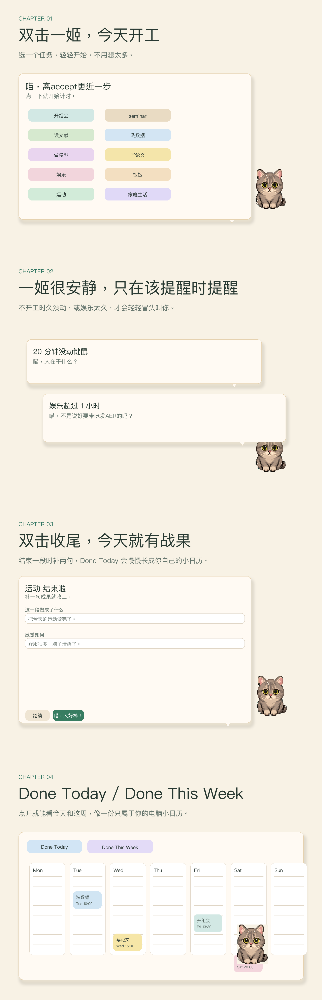

# yiji-got-your-back

这是一个只在电脑上工作的本地桌面小宠物项目。

`Yiji Focus Float` 会让一姬蹲在你的桌面上，陪你开始任务、结束任务，并把一天做过的事情长成一份看得见的时间表。



## 它现在能做什么

- 一姬以小宠物浮窗的形式悬在桌面上
- 双击一姬开始一段任务
- 再双击一次结束这一段
- 单击可以看 `Done Today` 和 `Done This Week`
- 只有在明显没动键鼠，或者娱乐太久时，才会轻轻提醒
- 所有记录都只存在本机，不做手机同步

## 目前平台

现在这版只支持 `macOS`。

它是原生 `.app`，不是跨平台壳子，所以 `Windows` 还不能直接运行。

## app 在哪里

成品在这里：

`plugins/yiji-focus-float/dist/Yiji Focus Float.app`

项目主体在这里：

`plugins/yiji-focus-float/`

## 怎么重新构建

在仓库根目录运行：

```bash
./plugins/yiji-focus-float/scripts/build-app.sh
```

然后直接打开：

`plugins/yiji-focus-float/dist/Yiji Focus Float.app`

如果只是本地测试最新版本，可以运行：

```bash
./plugins/yiji-focus-float/scripts/run-desktop.sh
```

## 如果朋友想自己改

### 改任务清单

编辑：

`plugins/yiji-focus-float/desktop/YijiDesktopFloat.m`

搜索：

`self.categories = @[`

这里控制开始气泡里的任务按钮。

### 改一姬说的话

编辑：

`plugins/yiji-focus-float/desktop/YijiDesktopFloat.m`

可以直接搜索这些句子：

- `喵，离accept更近一步`
- `喵，努力给咪挣罐罐鸭！`
- `喵，人好棒！`
- `喵，退下吧人。`
- `喵，人在干什么？`
- `喵，不是说好要带咪发AER的吗？`

### 改图片和动作

相关素材在这里：

- `plugins/yiji-focus-float/prototype/assets/`
- `plugins/yiji-focus-float/prototype/motions/idle/`
- `plugins/yiji-focus-float/prototype/motions/running/`
- `plugins/yiji-focus-float/prototype/motions/jumping/`
- `plugins/yiji-focus-float/prototype/motions/waving/`

现在的动作逻辑是：

- `idle`：待机静止
- `running`：开始任务时短暂精神一下
- `jumping`：结束任务时开心一下
- `waving`：退出前挥爪说明天见

## License

MIT
